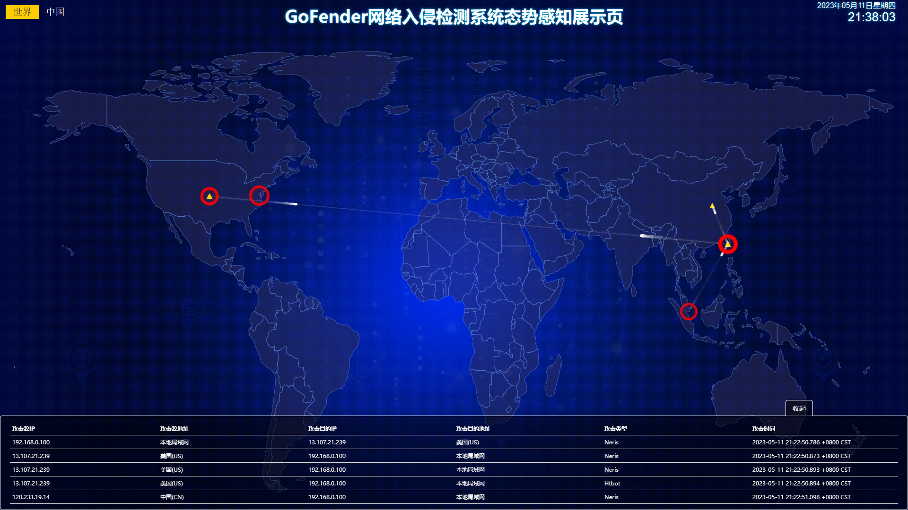

<div align="center">
    
    <h3 align="center">GoFender</h3>
    A minimalist NIDS based on Go and embedded with deep learning
</div>
<p></p>


[](https://golang.org)


------
## What's this?
GoFender is a network intrusion detection system developed based on Go and integrated with deep learning technology.

- Support distributed deployment
- Fast processing
- Using Deep Learning as an Intrusion Detection Algorithm

But, the project is mainly for learning purposes and is currently in its infancy, with only the more important parts
completed.

## Dependent environment and components

### Require environment(Installation Guide)

- [Go 1.18+](https://go.dev/)
- [Kafka](https://kafka.apache.org/documentation/#gettingStarted)
- [MySQL](https://dev.mysql.com/doc/)

### Dependent library(Installation Guide)

- [libpcap](https://www.tcpdump.org/index.html#latest-releases) or [npcap](https://npcap.com/)
- [TensorFlow-2.9.1 C library](https://www.tensorflow.org/install/lang_c)

## How to use?

#### 1. Clone or download project

```shell
# Mian Project + GoFender-WebUI(data visualization)
git clone --recurse-submodules https://github.com/iFANGXIE/GoFender.git
````

#### 2. Install Go、Kafka、MySQL

#### 3. Install dependent library

#### 4. Edit config file

```yaml
# example config.yaml
# Kafka Config
kafka_server: "127.0.0.1:9092"

# Mysql Server address
mysql_server: "127.0.0.1:3306"

# Mysql Config: user&password&database name
mysql_user: "your mysql user"
mysql_password: "your mysql password"
mysql_database: "your mysql database name"

# Web Server
web_addr: "127.0.0.1:8888"

#The rest of the configuration items can remain default 
```

#### 5. Run

```shell
 go mod tidy
 go run main.go
```

#### 6.Open web server address on your browser

```
http://127.0.0.1:8888/index/
```

after that you will see a visualization page



This page is a network attack hotspot map, which simply shows the attack time, geographical location, attack type, attack source, attack target and other information.

## Reference

- [Malicious-Traffic-Classification](https://github.com/BeStrongok/Malicious-Traffic-Classification)
- [tfgo](https://github.com/galeone/tfgo)
- [suricata-rules](https://github.com/al0ne/suricata-rules)
- [IP2Location](https://lite.ip2location.com/) & [GeoLite2](https://dev.maxmind.com/geoip/geoip2/geolite2/)
- [traffic-analysis](https://github.com/netxfly/sec-dev-in-action-src/tree/main/traffic-analysis)

## Copyright & License

Copyright (C) 2023 iFANGXIE

GoFender is released under the GUN License. See the [LICENSE](./LICENSE) file for more details.

